# HackTheBox - Forest

## Task 1
**For which domain is this machine a Domain Controller?**

Primero como siempre enumeramos con nmap para ver que puertos tiene abiertos la máquina. Aqui ya podemos fijarnos que seguramente hay un DC debido a los puertos abiertos y los servicios que corren en ellos: 53:UDP, 88:Kerberos, 389:LDAP, 445:SMB, 3268:CATLOG_LDAP, 5985:WinRM

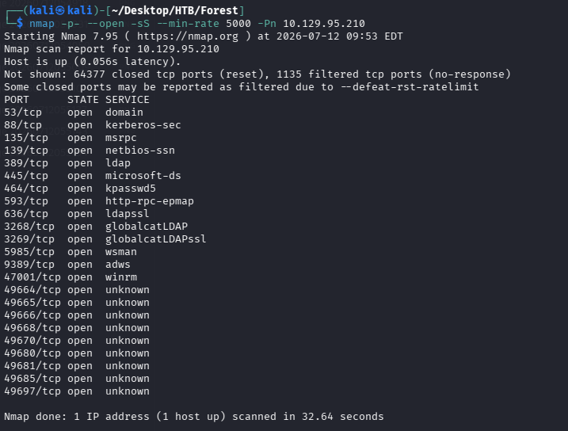

Al ver que tenemos el puerto de SMB intentamos enumerarlo.

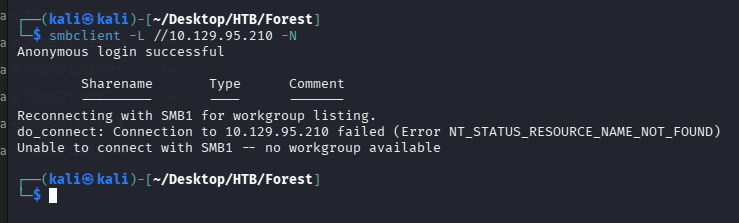

Sin credenciales no podemos aceder a nada.

Después de la primera enumeración con Nmap, observamos varios servicios relacionados con Active Directory, como DNS, Kerberos, LDAP y SMB, por lo que podemos sospechar que estamos ante un Domain Controller.

Para confirmar esta información y obtener el nombre del dominio podemos utilizar diferentes herramientas. En este caso utilizaremos dos métodos:

NetExec realiza una conexión contra el servicio SMB y obtiene información que Windows expone durante la negociación, como el hostname de la máquina, el dominio asociado y el sistema operativo.

En la salida podemos observar:

- Hostname: FOREST
- Dominio: htb.local

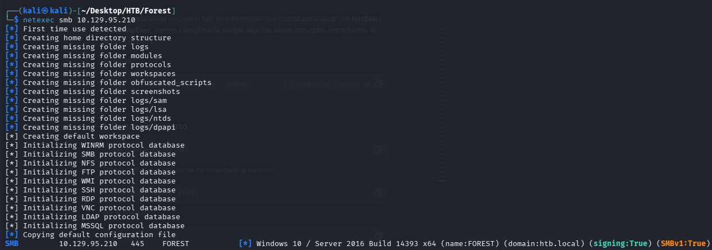

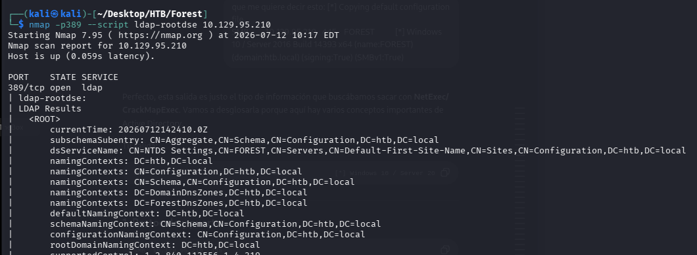

Una de las formas de obtener información básica del dominio es consultando el servicio LDAP mediante el script `ldap-rootdse` de Nmap. Que devuelve lo mismo que utilizando la herramienta ldapsearch y preguntando por los datos basicos al dominio.

---

## Task 2
**Which of the following services allows for anonymous authentication and can provide us with valuable information about the machine? FTP, LDAP, SMB, WinRM**

Aqui como hemos visto antenriormente SMB no lo permite. Y también al ejecutar el nmap con el script ldap-rootsde he comparado salidas con el ldapsearch

```bash
ldapsearch -x -H ldap://10.129.95.210 -s base
```

Y la salida exitoso nos dice si que da información útil de la máquina.

*No pongo captura por que literalmente es la de nmap con el script de ldap*

---

## Task 3
**Which user has Kerberos Pre-Authentication disabled?**

Lo primero que tenemos que hacer para ver que usuario tiene desactivado el pre-auth es saber que usuarios existen en el dominio.

Primero intento hacerlo directo, con un filtro LDAP que busca usuarios con el flag DONT_REQUIRE_PREAUTH activado en userAccountControl (la regla 1.2.840.113556.1.4.803 es una comprobación bit a bit sobre ese atributo):

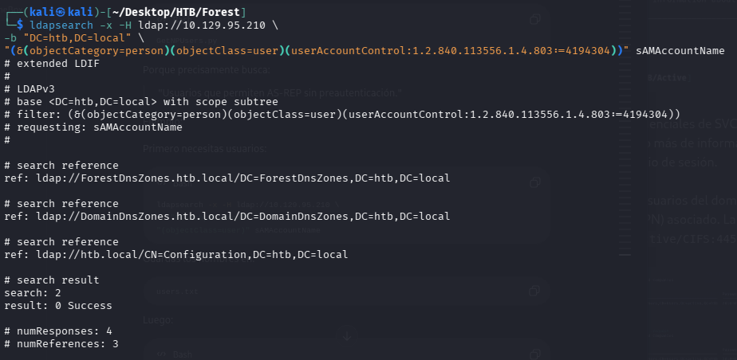

Este churro busca exactamente eso: usuarios con pre-auth desactivado, filtrando directamente por el bit correspondiente en userAccountControl. El problema es que el bind anónimo por LDAP nos deja hacer consultas básicas (como el rootDSE que vimos en la Task 2), pero no tiene permisos suficientes para evaluar un filtro de este tipo sobre el árbol completo de usuarios — por eso devuelve 0 Success sin resultados, aunque la sintaxis esté bien.

Como la vía directa no funciona, probamos a enumerar usuarios de forma más simple, pidiendo solo el atributo sAMAccountName sin filtros complejos:

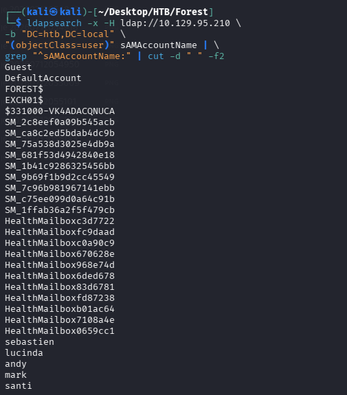

Esta consulta sí que la permite el bind anónimo, porque es una lectura simple de un atributo, no una evaluación de bit a nivel de todo el árbol. Con esto sacamos la lista completa de usuarios del dominio (incluyendo cuentas de servicio con nombres raros tipo HealthMailbox*).

Filtrando el ruido, montamos un user.txt con los usuarios que parecen reales:

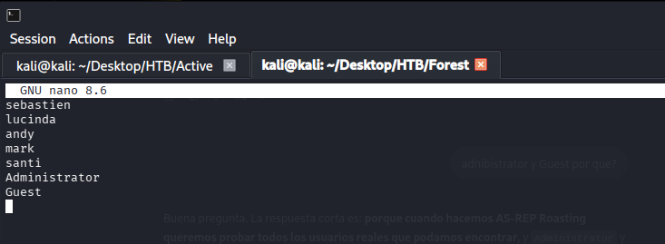

Metemos también Administrator y Guest por si acaso, aunque sabemos que probablemente no van a ser vulnerables.

Con esta lista corremos GetNPUsers para buscar quién tiene el pre-auth desactivado, pero no encuentra nada — ninguno de estos usuarios es vulnerable. Así que cambiamos de vía y probamos a enumerar usuarios por RPC:

```bash
rpcclient -U "" -N 10.129.95.210
rpcclient $> enumdomusers
```

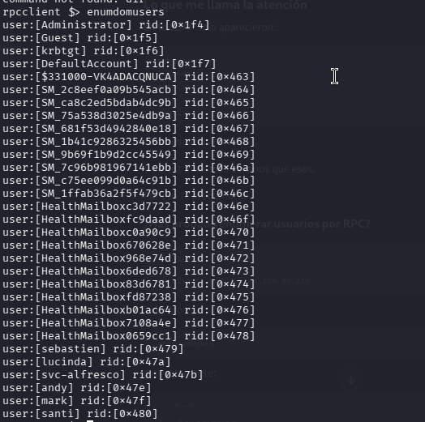

Con svc-alfresco ya en nuestra lista, volvemos a correr GetNPUsers y esta vez sí conseguimos el hash AS-REP:


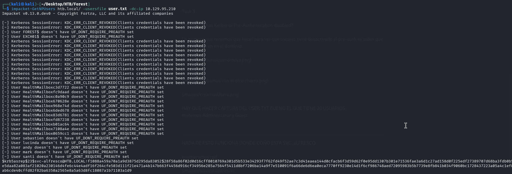

---

## Task 4
**What is the password of the user svc-alfresco?**


Despues de utilizar herramientas como hashcat o john ripper logramos sacar la contraseña:

s3rvice

---

## Task 5
**To what port can we connect with these creds to get an interactive shell?**

Aqui volvemos a mirar NMAP vemos que nuestro puerto de WinRM está abierto (5985)

intentamos conectarnos remotamente con evil-WinRM

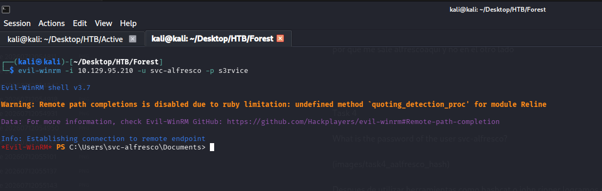

---

## Task 6
**Submit the flag located on the svc-alfresco user's desktop.**

Navegar al escritorio y mirar la flag, no hay que hacer "nada"

---

## Task 7
**Which group has WriteDACL permissions over the HTB.LOCAL domain? Give the group name without the `@htb.local`.**


Con las credenciales de svc-alfresco ya podemos autenticarnos en el dominio, así que recolectamos toda la información de Active Directory con BloodHound:
```bash
bloodhound-python -u svc-alfresco -p 's3rvice' -d htb.local -c All -ns 10.129.95.210 --zip
```

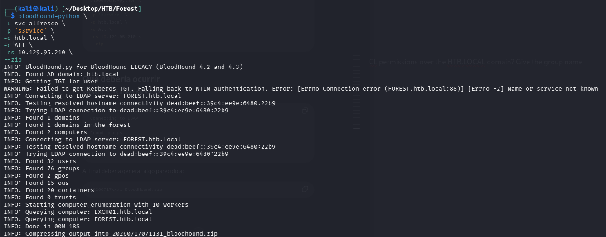

Esto genera un .zip con usuarios, grupos, permisos y relaciones del dominio. Lo subimos a BloodHound (interfaz web) para analizarlo visualmente.
Buscamos el nodo del dominio HTB.LOCAL y miramos qué grupos u objetos tienen permisos de control sobre él ("Inbound Object Control"):

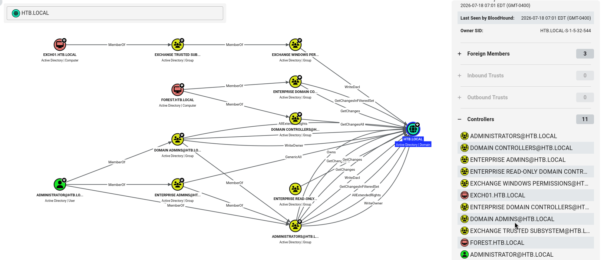

Aquí aparecen varias relaciones distintas (WriteOwner, GenericAll, GetChanges, etc.), pero la que nos interesa es WriteDacl, porque es la que da acceso a modificar los permisos del propio dominio. Revisando cada relación una por una, encontramos que el grupo Exchange Windows Permissions tiene un WriteDacl directo (no heredado) sobre el objeto dominio:

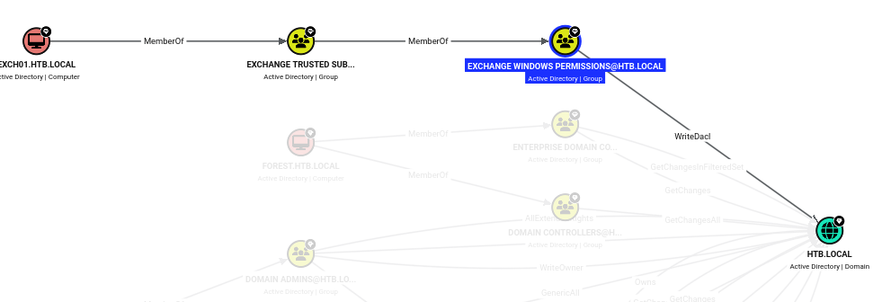

Esto es una mala configuración conocida: por defecto, ciertos grupos relacionados con Exchange reciben permisos elevados sobre el dominio para poder gestionar cosas como los buzones de correo, y eso se traduce en un WriteDacl que no debería existir con tanta libertad.

---

## Task 8
**The user svc-alfresco is a member of a group that allows them to add themself to the "Exchange Windows Permissions" group. Which group is that?**

Mirando en BloodHound los grupos de los que `svc-alfresco` es miembro (directa o indirectamente), vemos esta cadena:

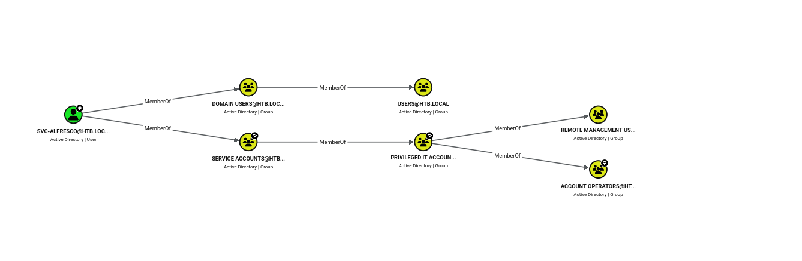

`svc-alfresco` → `Service Accounts` → `Privileged IT Accounts` → **`Account Operators`**

**Account Operators** es un grupo integrado de Active Directory con privilegios especiales: sus miembros pueden crear y modificar cuentas de usuario, y añadirlas a grupos que no estén "protegidos" (es decir, grupos que no tengan el atributo `adminCount=1`, como Domain Admins).

Como `Exchange Windows Permissions` no es un grupo protegido, `svc-alfresco`, gracias a ser miembro de `Account Operators`, puede añadirse a sí mismo directamente a ese grupo sin necesitar más permisos.


---

## Task 9
**Which of the following attacks you can perform to elevate your privileges with a user that has WriteDACL on the domain? PassTheHash, PassTheTicket, DCSync, KrbRelay**


La respuesta es **DCSync**, y la razón es esta:

`WriteDacl` sobre el dominio significa que puedes modificar la lista de permisos (ACL) del propio objeto dominio. O sea, puedes añadirte a ti mismo un permiso nuevo que antes no tenías. En concreto, puedes darte los permisos de replicación (`DS-Replication-Get-Changes` y `DS-Replication-Get-Changes-All`), que son justo los que necesita un Domain Controller para "pedirle" a otro DC que le mande copias de las contraseñas de los usuarios durante la replicación normal del dominio.

Si te das esos permisos a ti mismo, el controlador de dominio no distingue entre tú y un DC de verdad pidiendo esa información — así que te la da igual. Eso es exactamente lo que hace un ataque **DCSync**: hacerte pasar por un DC para que te "repliquen" las contraseñas, sin necesitar acceso directo a la máquina.

Por qué no son las otras:

- **Pass the Hash**: sirve para autenticarte usando un hash NTLM que ya tienes, en vez de la contraseña en texto plano. No tiene nada que ver con permisos de ACL — aquí todavía no tenemos ningún hash, así que no aplica en este punto.
- **Pass the Ticket**: parecido al anterior pero con tickets Kerberos (TGT/TGS) en vez de hashes. Tampoco tiene relación con modificar permisos del dominio.
- **KrbRelay**: es un ataque de relay de autenticación Kerberos (aprovechar una autenticación de otro para colarte en un servicio). Ninguna parte de este ataque implica tocar la ACL del dominio.

Solo `WriteDacl` te da la capacidad de **modificar permisos**, y el único ataque de la lista que se basa en aprovechar ese cambio de permisos es **DCSync**.
t7


---

## Submit Root Flag
**Submit the flag located on the administrator's desktop.**

Lo primero que tenemos que hacer es mirar en que grupos se encuentra alfresco

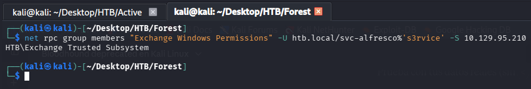


Tras comprometer la cuenta svc-alfresco, se aprovecharon los privilegios delegados sobre Exchange para añadir el usuario al grupo Exchange Windows Permissions utilizando bloodyAD. La pertenencia a este grupo permitió modificar permisos dentro del dominio, paso necesario para otorgar posteriormente los privilegios de DCSync.

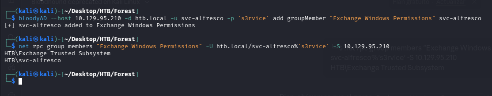

Una vez comprometida la cuenta svc-alfresco, se le asignaron permisos de DCSync sobre el dominio. Esta técnica permite a un usuario con los privilegios adecuados solicitar al controlador de dominio la replicación de credenciales, simulando el comportamiento de un Domain Controller.


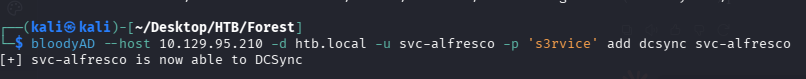

Con los permisos DCSync ya asignados, se utilizó secretsdump.py para replicar las credenciales del dominio y obtener el hash NTLM del usuario Administrator. Este hash sería utilizado posteriormente para autenticarse sin conocer la contraseña en texto plano.
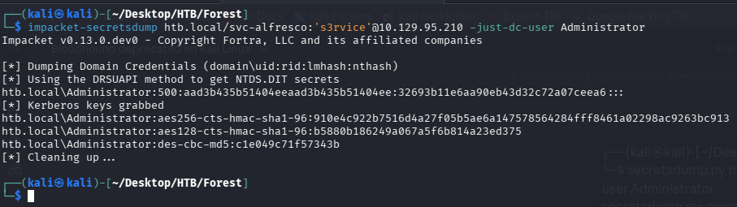

Finalmente, se realizó un ataque Pass-the-Hash mediante Evil-WinRM, autenticándose como Administrator utilizando el hash obtenido anteriormente. Tras acceder al sistema con privilegios máximos, se leyó el archivo root.txt, completando con éxito la máquina.

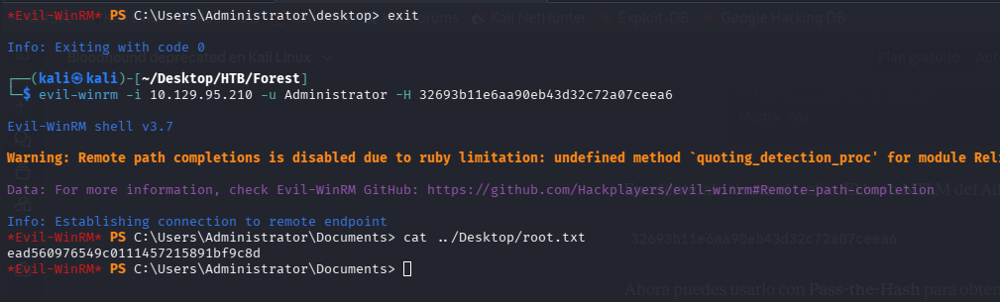

