# HackTheBox - Monteverde

## Task 1

**What is the domain name that Monteverde is acting as a domain controller for?**

Lo primero que hacemos, como siempre, es lanzar un `nmap` para ver qué puertos tenemos abiertos.

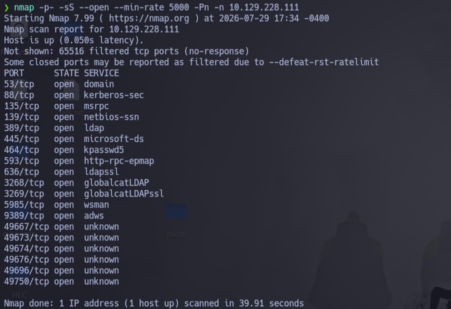

Utilizamos `netexec` porque vemos que hay varios puertos que tienen que ver con un AD (53, 88, 389, 445, 464, 3268...).

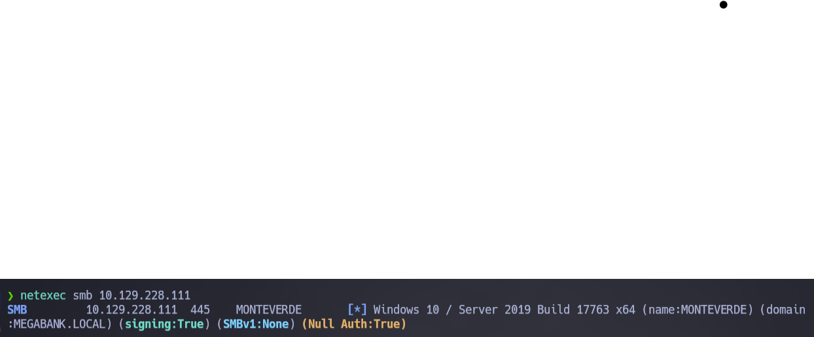

---

## Task 2

**What is the username for the service account for the AD Connect synchronization service?**

Primero, como no sabíamos lo que era AD Connect (o por lo menos yo no lo sabía), lo buscamos: **Azure AD Connect** es una herramienta de Microsoft que sincroniza un Active Directory local (on-premise) con Azure Active Directory (la nube).

Lo que entendemos aquí es que tenemos que enumerar usuarios, así que hacemos un `netexec` de usuarios anónimos:

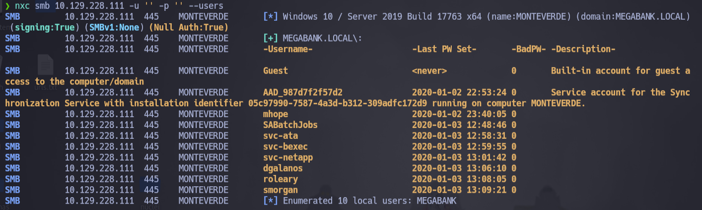

Leyendo un poco, vemos que la cuenta de sincronización sería la correspondiente a **AAD** (Azure Active Directory).

---

## Task 3

**Which user on Monteverde uses their username as a password?**

Ya tenemos los usuarios, así que vamos a hacer una especie de password spraying, probando el propio nombre de usuario como contraseña para cada uno de ellos.

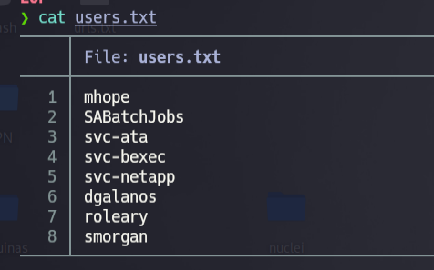

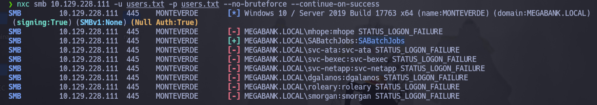

---

## Task 4

**What share contains a file with a users Azure configuration?**

Una vez tenemos las credenciales, lo que hacemos es usarlas para ver los shares y comprobar qué nos sale.

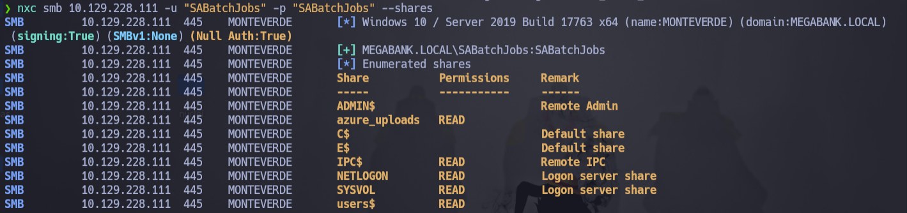

Nos conectamos al share con `smbclient` para empezar a indagar:

```bash
smbclient //10.129.228.111/<nombre_del_share> -U '<usuario>%<password>'
```

---

## Task 5

**What is the mhope user's password?**

Hacemos un `get` del archivo que nos sale en el escritorio de mhope para analizarlo.

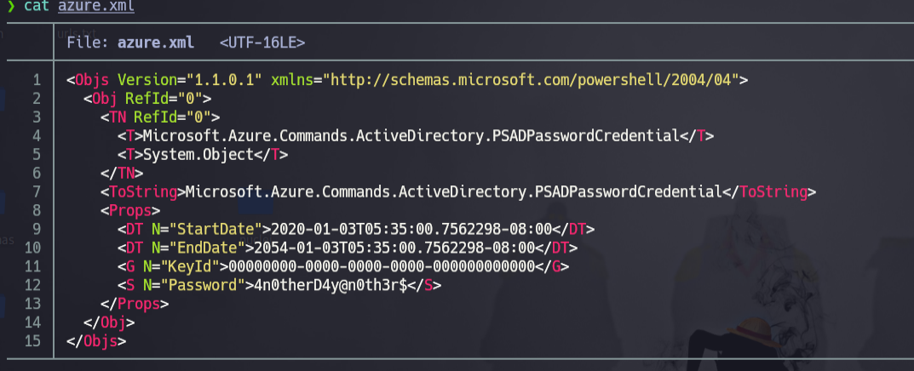

La contraseña sale en claro porque es un archivo de configuración de AD Connect (sincronización con Azure).

---

## Submit User Flag

**Submit the flag located on the mhope user's desktop.**

Una vez tenemos las credenciales de mhope, nos metemos con `evil-winrm`, vamos hasta el Desktop de mhope y sacamos la flag.

```bash
evil-winrm -i 10.129.228.111 -u mhope -p '<password>'
```

---

## Task 7

**What group is mhope a member of that has to do with syncing Active Directory information with the cloud based version at the time?**

Como ya tenemos acceso, podemos hacer una query con `evil-winrm`.

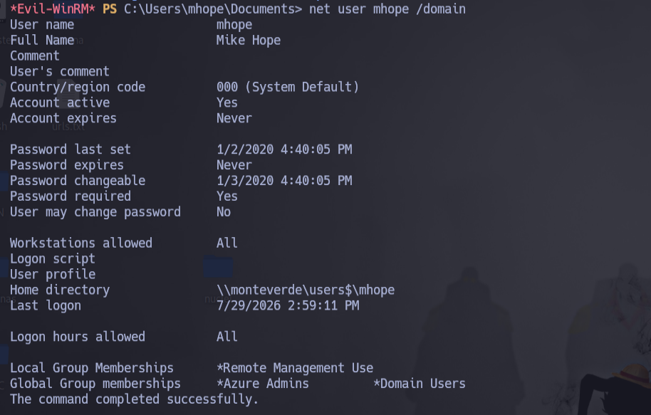

Como vemos en el campo *Global Group Membership*, mhope pertenece al grupo **Azure Admins**, que permite leer todos los hashes, etc.

---

## Task 8 / Submit Root Flag

**What is the administrator user's password on Monteverde?**

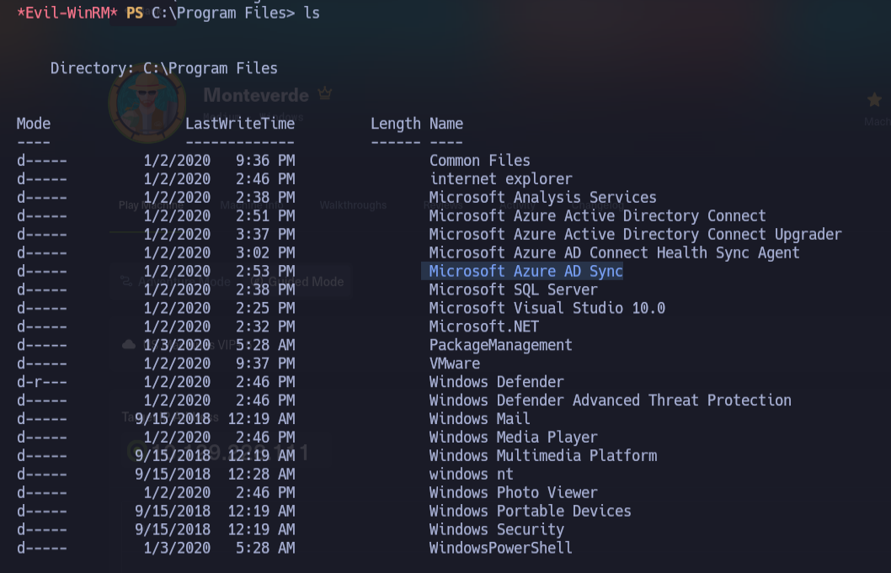

El grupo Azure Admins tiene permisos sobre el servicio de Azure AD Connect, que guarda credenciales con privilegios elevados (en este caso, del propio Administrator) para poder sincronizar el directorio con la nube. Existen herramientas públicas que permiten extraer esas credenciales en claro desde la base de datos del servicio.

Buscamos el repositorio en GitHub con la herramienta necesaria:

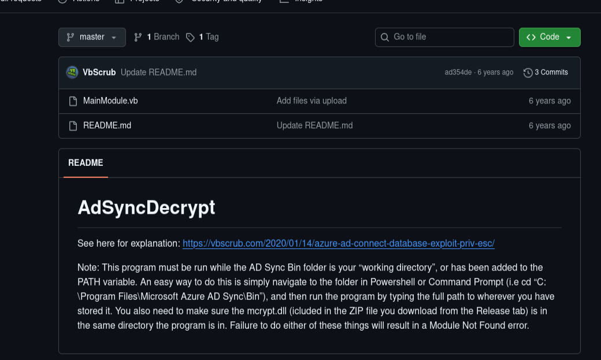

Lo descargamos y lo descomprimimos:

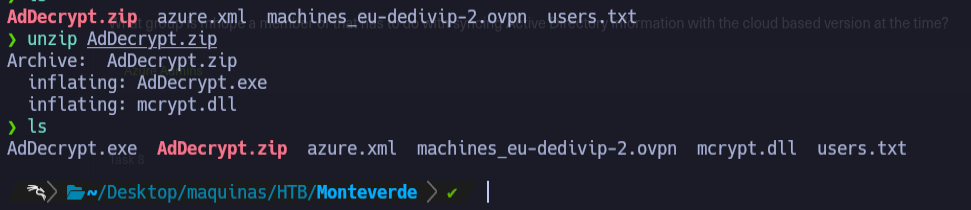

Ahora solo tenemos que pasar el `.exe` y el `.dll` a la máquina víctima:

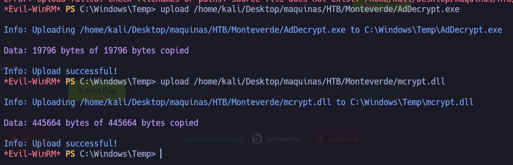

Como nos dice el `README` del repositorio de GitHub, hay que ejecutar la herramienta desde la ruta:

```
C:\Program Files\Microsoft Azure AD Sync\Bin
```

con el parámetro `--FullSQL`.

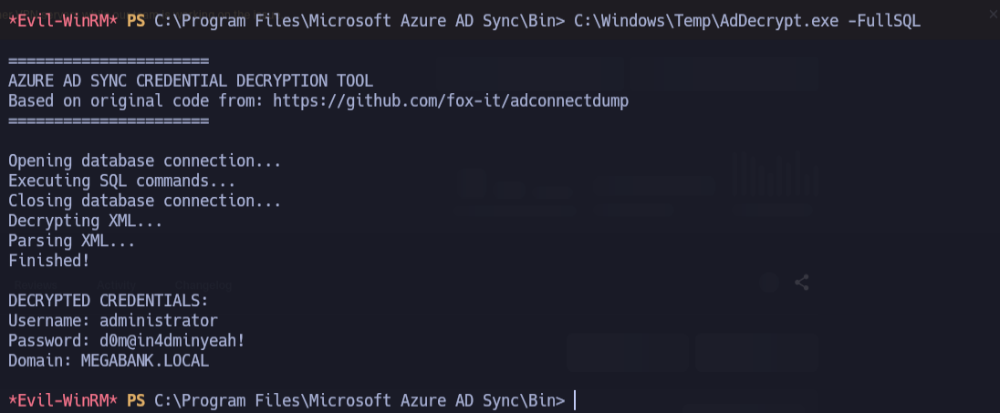

Tras acceder con privilegios de Administrator, leemos `root.txt` y completamos la máquina.

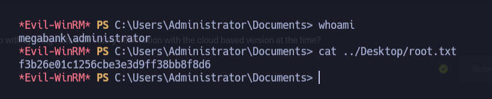
