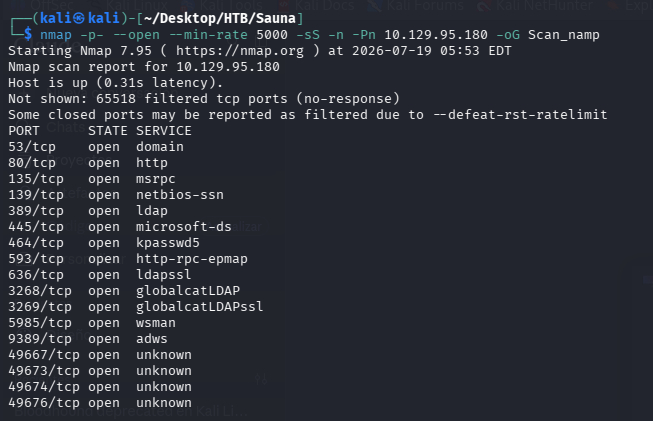
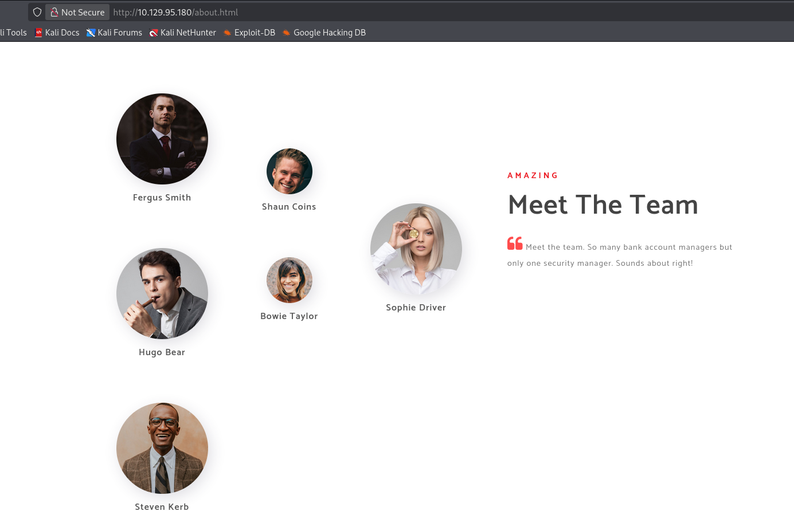
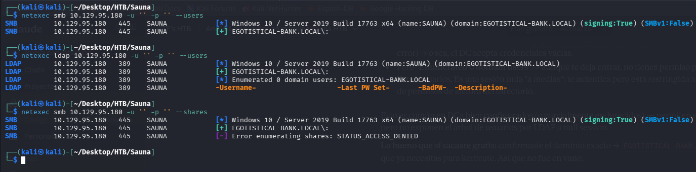
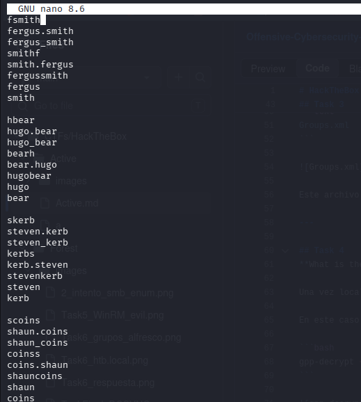
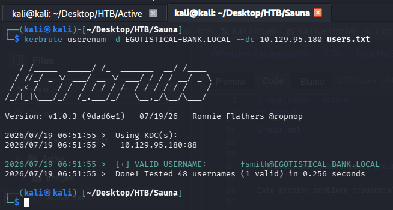
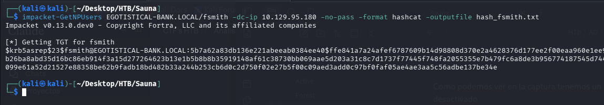
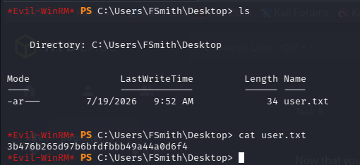
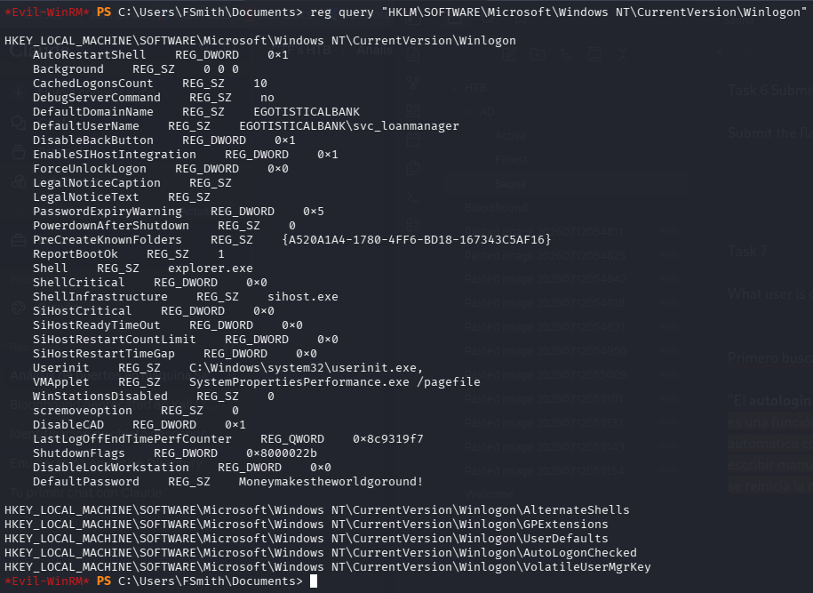
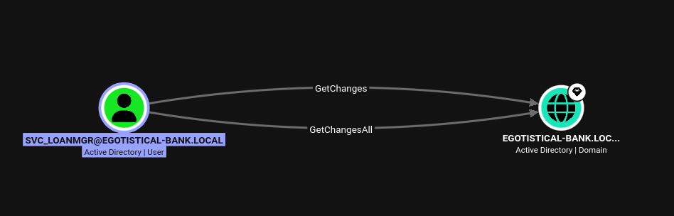
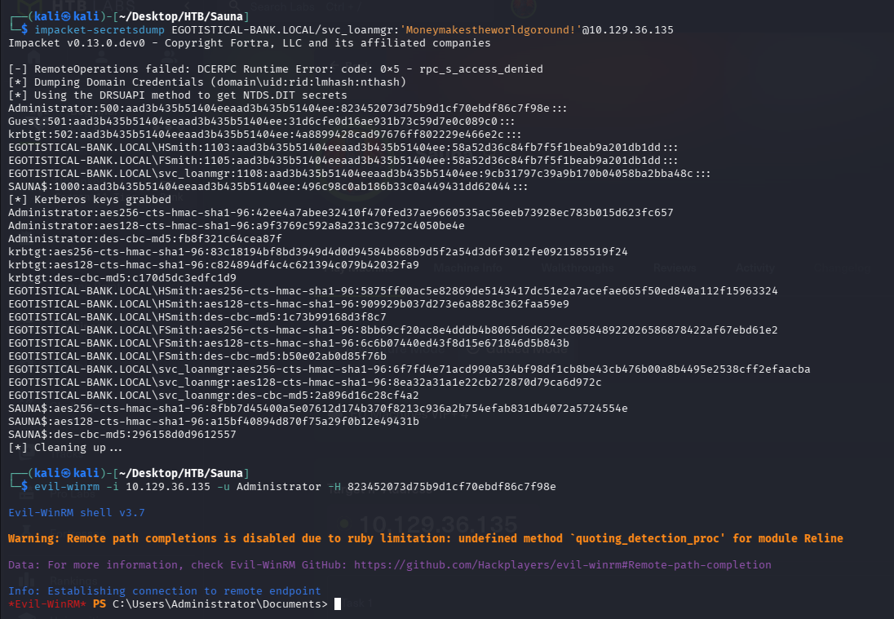

# HackTheBox - Sauna

## Task 1

**What is the name of the HTML file that reveals the names of users working at the target company?**

Lo primero que hacemos es un reconocimiento con nmap para ver que puertos tiene nuestro objetivo abiertos.



Como se puede apreciar, se puede intuir que detrás de esta máquina existe un AD, pues hay puertos como el 53, 389, 445, 464, 3268, 3269...

En esta tarea en concreto nos interesa el puerto 80, que es el que corre el servicio HTTP.

Investigando un poco, la página HTML que tiene información de posibles usuarios sería `about.html`.



---

## Task 2

**Which user has Kerberos Pre-Authentication disabled?**

Lo primero que voy a intentar es ver si con autenticación anónima puedo ver nombres de usuarios o algún material por SMB o LDAP.



No hemos sacado usuarios, pero por lo menos hemos sacado el nombre del dominio

Mirando un poco y yendo a la parte más obvia, podemos crear una wordlist con los usuarios que hemos encontrado en `about.html` e intentar enumerar con **kerbrute**.

Lo que haremos a continuación es crear una lista con nombres tipo `sAMAccountName` y pasársela a kerbrute.



Se lo pasamos a kerbrute:



Como podemos ver en la captura, tenemos un usuario que sí tiene el pre-auth desactivado:

**fsmith@EGOTISTICAL-BANK.LOCAL**

---

## Task 3

**What is the hash format returned from this AS-REP Roasting attack? Given the answer as the string between the first and third `$` characters, including the `$`.**

Utilizamos la herramienta `impacket-GetNPUsers` para pasarle el nombre de usuario sin pre-auth al DC y ver si nos devuelve el TGT con la contraseña hasheada.

Este es el ataque conocido como **AS-REP Roasting**: al tener el flag `DONT_REQUIRE_PREAUTH` activado, el KDC nos entrega directamente un TGT cifrado con la clave derivada de la contraseña del usuario, sin necesidad de autenticarnos primero. Ese hash lo podemos crackear offline sin tocar para nada al DC.



El formato devuelto es `$krb5asrep$23$`.

---

## Task 4

**What is the password of the user fsmith?**

Para la contraseña utilizamos hashcat.

**password: Thestrokes23**

---

## Task 5

**Now that you have a valid set of credentials, on what port can you connect to the machine and get an interactive shell?**

Miramos qué puertos están abiertos en la captura de nmap que hemos hecho anteriormente (ver Task 1).

Vemos que el puerto 5985 está abierto. Entramos con evil-winrm:

```bash
evil-winrm -i 10.129.95.180 -u fsmith -p 'Thestrokes23'
```

---

## Task 6 — Submit User Flag

**Submit the flag located on the fsmith user's desktop.**



---

## Task 7

**What user is configured to autologin?**

Primero buscamos qué es el autologin en AD:

_"El autologin (o inicio de sesión automático) en un entorno de Active Directory (AD) es una función que permite a un equipo con Windows iniciar sesión de forma automática con una cuenta de usuario del dominio sin que la persona tenga que escribir manualmente su nombre de usuario y contraseña cada vez que se enciende o se reinicia la máquina."_



```
DefaultDomainName   REG_SZ   EGOTISTICALBANK
DefaultUserName     REG_SZ   EGOTISTICALBANK\svc_loanmanager
```

---

## Task 8

**What is the password of the svc_loanmanager user?**

```
DefaultPassword   REG_SZ   Moneymakestheworldgoround!
```

(Visible en la misma clave de registro de Winlogon de la Task 7, junto al resto de valores de autologin.)

---

## Task 9

**What dangerous permission does Bloodhound show the svc_loanmanager user has over the domain? If there is more than one permission, give the longest.**



BloodHound muestra que `svc_loanmanager` tiene sobre el objeto dominio `EGOTISTICAL-BANK.LOCAL` los permisos **GetChanges** y **GetChangesAll**.

Esta combinación es exactamente la que se necesita para ejecutar un ataque **DCSync**: son los mismos derechos de replicación que un Domain Controller legítimo usa para sincronizar contraseñas con otro DC. Si un usuario normal los tiene asignados, puede hacerse pasar por un DC y pedirle al controlador de dominio real que le "replique" las credenciales de cualquier cuenta, incluida la del Administrator, sin necesitar acceso directo a la máquina.

La respuesta más larga (y la que da más privilegio) es **GetChangesAll**.

---

## Task 10 / Submit Root Flag

**You know that the user svc_loanmanager is able to perform a DCSync attack. By doing so, you will get the hash for the Administrator user. What is the common name of the attack that allows users to authenticate with their hashes instead of cleartext passwords?**

Con los permisos de replicación (`GetChanges` / `GetChangesAll`) confirmados en la Task 9, lanzamos el ataque **DCSync** con `impacket-secretsdump` usando las credenciales de `svc_loanmanager`, para volcar todas las credenciales del dominio directamente desde el DC:

```bash
impacket-secretsdump EGOTISTICAL-BANK.LOCAL/svc_loanmgr:'Moneymakestheworldgoround!'@10.129.36.135
```



Esto nos entrega el hash NTLM del usuario `Administrator`. Con ese hash, ya no necesitamos la contraseña en texto plano: nos autenticamos directamente contra el servicio WinRM usando el propio hash, mediante un ataque de **Pass-the-Hash**:

```bash
evil-winrm -i 10.129.36.135 -u Administrator -H 823452073d75b9d1cf70ebdf86c7f98e
```

La respuesta a la pregunta de la Task 10 es, por tanto, **Pass-the-Hash**: la técnica que permite autenticarse usando el hash NTLM de la contraseña en lugar de la contraseña en texto plano.

Tras acceder con privilegios de Administrator, leemos `root.txt` y completamos la máquina.
